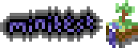
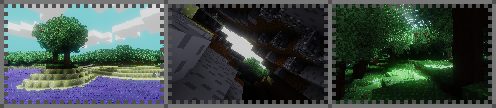

# 
[*Download*](https://github.com/danil275487/minitest/archive/refs/heads/main.zip)

Minitest is a survival [Luanti](https://luanti.org/) game mainly inspired by [Minicraft](https://wikipedia.org/wiki/Minicraft) and similar games.

You wake up in a lush colorful world with no recollection of who or where you are, and you must thrive.
Start off by gathering twigs and rocks, then using your trusty stone axe chop down trees, before making a crafting bench using 2 planks and sticks.

Requires Luanti 5.10 to run properly.
The ingame colors and textures mostly use the 16 color palette taken from the [Commodore 64](https://wikipedia.org/wiki/Commodore_64) with a resolution of 8x8 pixels, with plenty of tweaks and adjustments to visuals.
### This game is **work-in-progress** and major refactoring is on the way. Expect game-breaking bugs and issues.

## Features roadmap
### for the near future
- [ ] Make the game use tilesheets
- [ ] Tidy up most of the code 
- [ ] Redo many item names
- [ ] Refactor the mod structure (make it less modular, what was I smoking back then)
- [ ] Add a crafting book
- [ ] Add basic sounds
- [ ] Add mobs and enemies
- [ ] Rewrite and redesign aspects like farming and hunger (aka not steal them from MTG and stamina mod)
- [ ] Get it ready for ContentDB? :3
